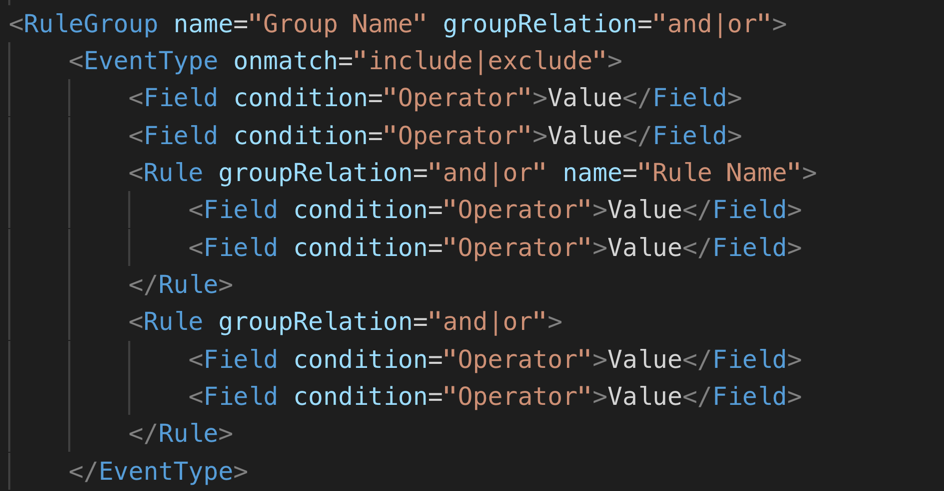
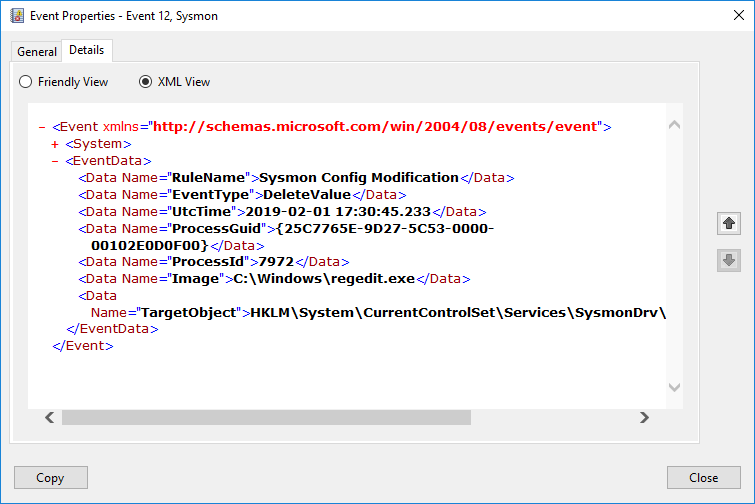
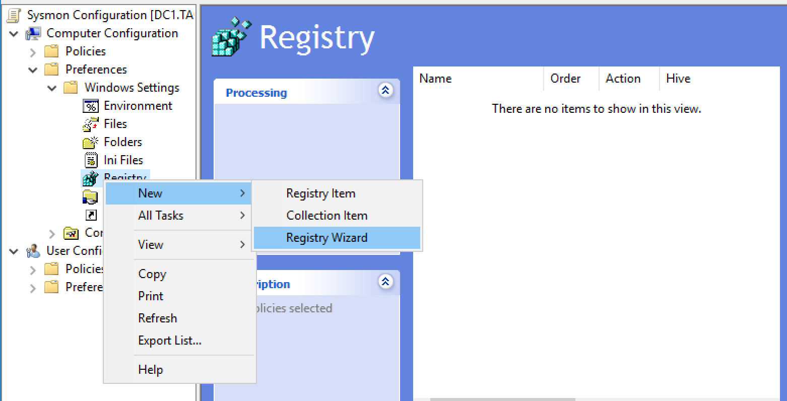
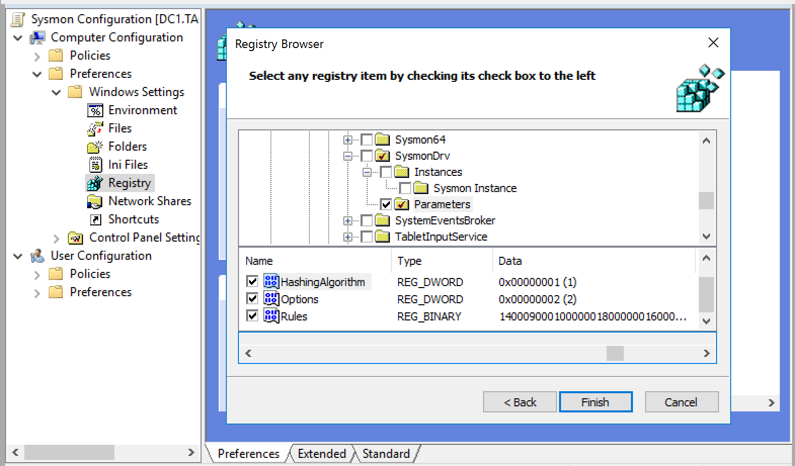

Configuration
-------------

The configuration options of Sysmon and the structure of the configuration file are defined in its schema. Each version of Sysmon that adds capabilities raises the schema version, and this version number is not tied to the binary version number.

To take a look at this schema, we would run the binary with the  **-s \[schema version\]** parameter; if no schema version is specified, we would get the latest one for the binary.

When we look at the XML representation of the schema, we see the manifest element has two attributes for versioning:

* **schemaversion** - The version number of the schema

* **binaryversion** - The binary version number of the compiled schema

Under this manifest element are two main elements:

* **configuration** - Command line switches for the executable and the filtering operators
* **events** - This section defines each event type and field we can filter on


Command Line Parameters
-----------------------

Under the configuration element, we have an element called options that contains all the command line parameters. Each of the option elements are broken in to command line and configuration options where each type of the command line switches is identified with a comment in the XML.

The main attributes for each of the command-line options:

* **switch** - the command line switch to use.

* **name** - name of the switch.

* **argument** - is the argument optional or mandatory


Not all command parameters shown in the Schema apply to Sysmon for Linux, both tools share the general schema but in the Linux version only a subset of the parameters are implemented.

Windows Parameters:

The main arguments that can be passed are:

* **-i** : Install Sysmon

```shell
sysmon.exe -i [configfile path]
```

```shell
sysmon. -i [configfile path]
```

* **-c** : apply config

```shell
sysmon.exe -c [configfile path]
```

* **-u** : un-install Sysmon

```shell
sysmon.exe -u [force]
```

* **-m** : Install event manifest (Windows Only)

```shell
sysmon.exe -m
```

* **-t** : Debug mode (Windows Only)

```shell
sysmon.exe -t [configfile path]
```

* **-s** : Print schema

```shell
sysmon.exe -s [schema version]
```

* **-nologo** : don't show sysmon logo (Windows Only)

```shell
sysmon.exe -nologo
```

* **-accepteula** : Accepts the license agreement

```shell
sysmon.exe -accepteula
```

* **--** : Resets the configuration to the default

```shell
sysmon.exe -c --
```

The option elements under the comment "Configuration file" allow for the configuration of filters and parameters that relate to filters.

* **-h** : Hashing algorithm to has images. (Windows Only)

```shell
sysmon.exe -c -h <sha1|sha2|md5|imphash|*>
```

* **-r** : Check for signature certificate revocation (Windows Only)

```shell
sysmon.exe -c -r
```

* **-n** : Track network connections for specified process/processes.

```shell
sysmon.exe -c -n [<process,...>]
```

* **-k** : Track when a specified process/processes memory are accessed. (Windows Only)

```shell
sysmon.exe -c -k [<process,...>]
```

* **-l** : Track modules (DLLs) loaded by a specified process/processes. (Windows Only)

```shell
sysmon.exe -c -k [<process,...>]
```

* **-d** : Rename the sysmon driver during install (8 character limit) (Windows Only)

```shell
sysmon.exe -i -c -d <drivername>
```

> **-g** and **--dns** switches are listed but as of the current version, they (Windows Only)
> do not update the configuration.

Sysmon for Linux parameters are:

The main arguments that can be passed are:

* **-i** : Install Sysmon

```shell
/usr/bin/sysmon  -i [configfile path]
```

* **-c** : apply config

```shell
/usr/bin/sysmon -c [configfile path]
```

```bash
/ussr/bin/sysmon -u [force]
```

* **-s** : Print schema

```shell
/ussr/bin/sysmon -s [schema version]
```

* **-accepteula** : Accepts the license agreement

```shell
/ussr/bin/sysmon -accepteula
```

* **--** : Resets the configuration to the default

```shell
/ussr/bin/sysmon -c --
```

The option elements under the comment "Configuration file" allow for the configuration of filters and parameters that relate to filters.

* **-n** : Track network connections for specified process/processes.

```bash
/ussr/bin/sysmon -c -n [<process,...>]
```

Filter Operators
----------------

In the filters element under configuration is the list of operators that can be used to filter against the fields of each event type.

|  **Operator**     |  **Meaning**
|------------------|------------------------------------------------------
|  is|             Exact match.
|  is not|          Negates and exact match
|  is any|         Any of the exact values. (values are separate by ";" )
|  contains|       The string is contained in any part of the value of the field.
|  excludes |      Excludes the event from the logic if the event is the value matches
|  excludes all|   Exclude if all values match. (values are separate by ";" )
|  excludes any |  Excludes if any of the values match. (values are separate by ";" )
|  image |         Name of the image without the full path.
|  begins with |    String value starts with the specified string.
|  not begins with| String value does not starts with the specified string.
|  ends with |      String value ends with the specified string.
|  not ends with|  String value ends with the specified string.
|  LessThan  |     Numeric value is less than
|  MoreThan |      Numeric value is more than
|  Contain Any |   Contains any of the values. (values are separate by ";" )
|  Contains All |  Contains all of the values. (values are separate by ";" )

Each of these operators execute against the value in a given field for each of the event types.

Event Schema
------------

Under the events element each event that Sysmon generates is defined as an event element. Each event is defined as shown below:

* **name** : Name of event

* **value** : The EventID for the event

* **level** : Event severity level

* **template** : Event manifest template used for the event

* **ruleName** : Name of rule we filter on

* **ruledefault** : The default action of a rule if not specified

* **version** : The version of the event


We can filter on the Field Names defined in the data elements. They are defined as:

* **Name** : Name of filed

* **inType** : Type of data received in to the driver

* **outType** : Data type the data is presented as


As of the latest version we have defined as event types, one does need to be aware that not all fields and all event types will apply to both Sysmon fo Windows and Sysmon for Linux:

* **NetworkConnect** - Network connections made by processes on the system; both TCP and UDP

* **ProcessCreate** - Creation of new processes in the system and information related to the process

* **FileCreateTime** - File creation time modification and what process is responsible for it

* **ProcessTerminate** - The termination of a process

* **ImageLoad** - Loading of any image by another process (OCX, DLL, etc.) with information of the process loading the image and the image itself

* **DriverLoad*** - Loading of a driver by the system and its file information

* **DnsQuery** - DNS query performed by a process using Windows API, includes information on the query and the process that performed it

* **ProcessAccess** - Access to a process memory from another process and information on access permission and the processes involved

* **RawAccessRead** - Raw access to a file by a process bypassing the file system controls

* **FileCreateStreamHash** - An alternate stream was created and the content of the stream is hashed; information on the process that created the stream is logged

* **RegistryEvent** - Logs the creation, deletion, and modification of specific registry keys and values; information on the process that took the action is logged

* **FileCreate** - Information of a file that is created including the process that created the file

* **PipeEvent** - Named Pipe communication between two processes and its relevant information

* **WmiEvent** - Information on the creation, deletion, and modification of WMI permanent event components in the CIM database

* **FileDelete** - Saves when possible and logs file deletion or file wipes.

* **ClipboardChange** - Stores and logs text that is stored in to the clipboard by processes and context of who stored the text.

* **ProcessTampering** - Detects some of the techniques of "hollow" and "herpaderp" where a process image is replace.

* **FileDeleteDetected** - Only logs file deletion or file wipes.

Configuration File
==================

The main method of configuration of Sysmon is through the use of XML configuration files. XML configuration files allow for higher flexibility since more filtering options are possible by applying logical operations to the fields that are defined by the schema version for the event types.

Previous schemas can be used in newer releases of the binary allowing for upgrading of the binary without the need to update the configuration. The schema is defined on the root element (Sysmon) of the configuration file with the attribute **schemaversion**.


We can optionally specify a hashing algorithm with the HashAlgorithms elements. More than one can be specified in this element or all of them using the \* symbol.
The presence of the CheckRevocation element is enough to allow for checking whether a certificate used to sign an image has been revoked. There are three main ways to organize filters with the latest version of Sysmon.

* EventType filters.

* EvenType Filters organized using RuleGroups

* EventType Filters organized in to Rule sets inside RuleGroups.

We can have up to two instances of each EventType (one include and one exclude) for the entire configuration, whether or not RuleGroups are used. On SchemaVersion 4.22 and above, the default relation between filters is AND.


Below is an example where if the filters match, they are included and placed in the EventLog using an intrinsic AND logic.


This type of configuration is only good with Schema 4.22 and above. It is recommended that this is used only for quick tests due the limitation of the AND logic for filters.

RuleGroups
----------

The RuleGroup element allows for the modification of the logic of the filters and also allows for more complex logic since multiple Rule elements with multiple filters can be created and the logic for the filters can be modified in order to capture actions in a more granular way.



Remember: You can only have one single EventType per RuleGroup. Sysmon will not error if you have more than one, but only the first EventType filters will be loaded.

In a RuleGroup element, the name attribute is not used to populate the RuleName field of an event when one is created. While it may be used for a description, XML comments are a better option. When choosing the name to go in the RuleName field, the order of precedence for RuleName is Filter -> RuleGroup name attributes. It is recommended that names be placed on the individual filters to be able to leverage the field more efficiently when filtering logs on a SIEM platform. One thing to keep in mind is that when multiple filters are in a Rule element, only the first filter name attribute is used.

When using AND in a Rule element, the name used to populate the RuleName will be based on the order of the filters as they appear on the schema where the last matching one is the one used. When using OR in a Rule element, the name used to populate the RuleName will be the filter that matches.

Rules are processed in the order they are placed in the configuration file. This is important because once a Rule matches and the information for that EventType is included in the Windows EventLog, no other rule will be processed against that action. Filters that are not in a Rule element will be processed in the order that they appear in the schema. This also applies to multiple filters inside a Rule where the schema order is used.


Configuration File Best Practices
---------------------------------

It is important to track what a configuration does and keep a changelog. For this reason, it is recommended to add headers to track basic information like changelog, version, sysmon version tested against, etc.


For RuleGroups, Rules and Filters use comments to organize filters and to provide information on what each filter is doing.


Hash configurations that are deployed and keep a log of them for later
verification.

Hash configurations that are deployed and keep a log of them for later verification.
On a system where the Sysmon service process consumes a lot of CPU resources, the number of filters and operators should be reviewed. The operators that use slightly more CPU are:

* contains

* contains all

* contains any

A method for checking applied configuration is hashing the configuration
in the registry.
<https://github.com/PSGumshoe/PSGumshoe/blob/master/EventLog/Get-SysmonRuleHash.ps1>


Since getting stated can be complex, some great resources that serve as starting points for Rule development and reference include:

* Swift On Security configuration example
    <https://github.com/SwiftOnSecurity/sysmon-config>

* Olaf Hartong Sysmon Configuration Modules
    <https://github.com/olafhartong/sysmon-modular>

Configuration Tampering
-----------------------

One of the actions an attacker takes is the identification of controls and logging on a system.

Due to initial footprint and safety, most advanced attackers limit their actions to enumerate controls to the most common actions that elements that will trigger a monitoring solution. The most common methods used are:

* Service list.

* Process list.

* Listing of installed applications from the registry (In the case of Windows).

This does not mean that an attacker will not use more advanced methods to enumerate controls and find Sysmon on the system.

Detection of Sysmon in Windowss is achieved by looking at the areas that cannot be changed.

  **Indicator**               | **Can it be Changed**
  ----------------------------| -----------------------
  |Driver Name|                  YES
  |Service Name|                 YES
  |Registry Config Path|         YES
  |Driver altitude Number|       NO
  |EventLog Path and Name|       NO
  |Sysmon Service Description|   NO (Manually)

When Sysmon configuration is modified using the Sysmon command line tool, an **EventId 16** is generated. If the registry binary value is modified directly, no event is generated, and configuration is applied as soon as the value is modified.

On Windows when a GPO is used to update configuration by default every 90 minutes, the configuration will be updated. A better solution is to use a configuration management solution like DSC that can monitor for changes and update as soon as a change is detected.

In the case of Linux a solution like Puppet or Ansible is recommended where the configuration file in **/opt/sysmon/config.xml** and **/opt/sysmon/rules.bin**.

Sysmon can be configured to monitor its own configuration to detect whether an attacker deletes or alters it. In the event that it is cleared, this will be the last event logged by Sysmon itself from its configured filters.




In the case of Sysmon for Linux the behavior is the same

```

Event SYSMONEVENT_CREATE_PROCESS
 RuleName: -
 UtcTime: 2021-10-17 22:30:12.058
 ProcessGuid: {2424faa4-a3f4-616c-e1b4-2270fe550000}
 ProcessId: 141030
 Image: /usr/bin/rm
 FileVersion: -
 Description: -
 Product: -
 Company: -
 OriginalFileName: -
 CommandLine: rm /opt/sysmon/rules.bin
 CurrentDirectory: /home/carlos/Desktop
 User: root
 LogonGuid: {2424faa4-0000-0000-0000-000000000000}
 LogonId: 0
 TerminalSessionId: 3
 IntegrityLevel: no level
 Hashes: -
 ParentProcessGuid: {2424faa4-a3f4-616c-d5ab-cd1b11560000}
 ParentProcessId: 141029
 ParentImage: /usr/bin/sudo
 ParentCommandLine: sudo
 ParentUser: carlos
Event SYSMONEVENT_FILE_DELETE
 RuleName: -
 UtcTime: 2021-10-17 22:30:12.062
 ProcessGuid: {2424faa4-a3f4-616c-e1b4-2270fe550000}
 ProcessId: 141030
 User: root
 Image: /usr/bin/rm
 TargetFilename: /opt/sysmon/rules.bin
 Hashes: -
 IsExecutable: -
 Archived: -
```

```
Event SYSMONEVENT_CREATE_PROCESS
 RuleName: -
 UtcTime: 2021-10-17 22:30:24.113
 ProcessGuid: {2424faa4-a400-616c-e194-bfcc63550000}
 ProcessId: 141036
 Image: /usr/bin/rm
 FileVersion: -
 Description: -
 Product: -
 Company: -
 OriginalFileName: -
 CommandLine: rm /opt/sysmon/config.xml
 CurrentDirectory: /home/carlos/Desktop
 User: root
 LogonGuid: {2424faa4-0000-0000-0000-000000000000}
 LogonId: 0
 TerminalSessionId: 3
 IntegrityLevel: no level
 Hashes: -
 ParentProcessGuid: {2424faa4-a400-616c-d57b-eebae9550000}
 ParentProcessId: 141035
 ParentImage: /usr/bin/sudo
 ParentCommandLine: sudo
 ParentUser: carlos
Event SYSMONEVENT_FILE_DELETE
 RuleName: -
 UtcTime: 2021-10-17 22:30:24.115
 ProcessGuid: {2424faa4-a400-616c-e194-bfcc63550000}
 ProcessId: 141036
 User: root
 Image: /usr/bin/rm
 TargetFilename: /opt/sysmon/config.xml
 Hashes: -
 IsExecutable: -
 Archived: -
```

In case the configurations are cleared, the default one will take over, in the case of Windows:

* **ProcessCreation**

* **ProcessTermination**

* **DriverLoad**

* **FileCreationTimeChanged**

* **SHA1 for Images**

For Linux the default configuration is:

* **ProcessCreation**

* **ProcessTermination**

In the case of Windows any user in the system can read the rule binary data, an attacker can operate around rule configurations once they have read them by:

* Execute tasks not logged.

* Execute tasks that would blend in with normal logged actions

Existing tools for parsing rules out of the registry break often as Sysmon is updated, since the way the information is structured in the binary blob is not documented. However, an attacker can export and import into the test system and use Sysmon to read the configuration.

It is also important to monitor any process that access the Sysmon service process to prevent suspension of the process or modification of it in memory.

For Linux only the root account can read and modify the the sysmon configuration file and its binary info. But the syslog file on most systems

Configuration Deployment
------------------------

Most environments that have the capabilities to leverage Sysmon enhanced log collection also have software deployment systems like Altiris, System Center Configuration Manager, Desired State Configuration, etc for Windows in the case of Linux we can leverage Ansible, Chef, Puppet and many other solutions. This is why these are just general recommendations.

Sylog Message Size
------------------

Syslog message size limits are dictated by the syslog transport mapping in use. By default the rsyslog package which is one of the most popular packages in distributions limit the size to 1024 bytes. It is important to prevent parsing errors of the structured data to set max sizes that match the size and transport of the messages configured for your given Syslog package. This is achieved using the **FieldSizes** XML element and setting a size for the CommandLine and Image field sizes. We can specify the field and the length we want for the field like in the example bellow.

```xml
<Sysmon schemaversion="4.81">
  <FieldSizes>CommandLine:100,Image:100</FieldSizes>
  <EventFiltering>
    
  </EventFiltering>
</Sysmon>
```

Fields that could benefit of this are:

* Image
* ParentImage
* CommandLine
* ParentCommandLine

Deployment Script
-----------------

On most of these environments, the deployment of Sysmon is managed by using scripts, with PowerShell being the most flexible one.

An install script should

* Check if Sysmon is installed; if not, Install.

* If Sysmon is installed, check the version and upgrade if needed.

* After an uninstall, ensure the registry key and files are removed before upgrading. (There have been issues in the past.)

```PowerShell
$DriverName = 'SysmonDrv.sys'
$CurrentVersion = '10.41'
# Check if the driver if present
$Present = Test-Path -Path "C:\Windows\$($DriverName)" -PathType Leaf
if ($Present) {
    Write-Host -Object "[+] Sysmon was found." -ForegroundColor Green
    # Check if the version on host is the approved one.
    $HostVersion = (Get-Item "C:\Windows\$($DriverName)").VersionInfo.FileVersion
    if ($CurrentVersion -eq $HostVersion) {
        Write-Host -Object "[+] Sysmon is current approved version." -ForegroundColor Green
    } else {
        # Execute upgrade process.
        Write-Host -Object "[-] Sysmon needs upgrade." -ForegroundColor Red
     <path to Sysmon.exe> -U
        <path to Sysmon.exe> -I
    }
} else {
    # Execute install process.
}
```

GPO Configuration Deployment
----------------------------

Group Policy remains one of the most used methods in the enterprise network for the control of configuration setting.

The following are instructions on how to create a GPO for an existing applied configuration.

1. In the Group Policy Management Console (**gpmc.msc**)

2. Create a new (or edit an existing) GPO and assign it to the appropriate Active Directory Organizational Unit.

3. Right click on the GPO and select **Edit**

4. Expand **Configuration -\> Preferences -\>Windows Settings -\> Registry**

5. Right Click on Registry **New -\> Registry Wizard**

   {width="6.5in" height="3.3125in"}

6. Select if local or remote machine.

7. Navigate and select the key **HKLM\\SYSTEM\\CurrentControlSet\\Services\\SysmonDrv\\Parameters** and all parameters under it.

  

A WMI filter will ensure only machines with the proper version of Sysmon installed will receive the configuration.
