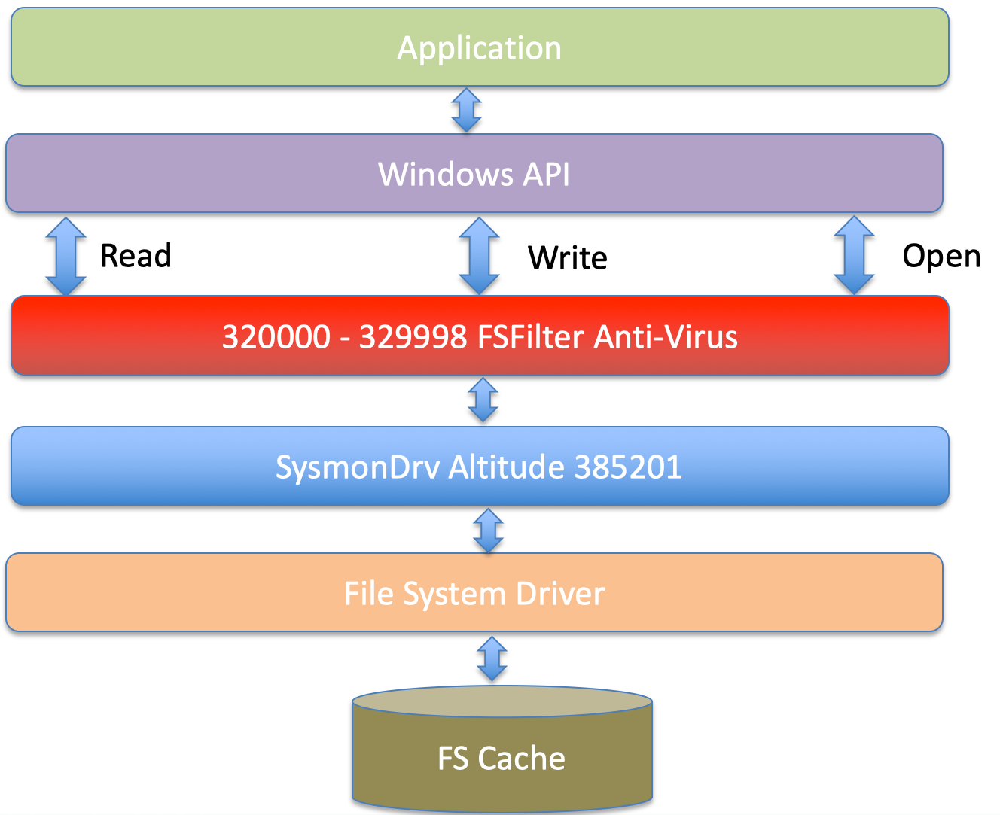

File Block EXE
===========

On version 14.1 of Sysmon the capability to log and block when a process is deleting a file by overwriting its file blocks. Events will be loggedusing **EventID 27**. This event type is found under schema version 4.83.




The minidriver inspect the action that is being taken to see if it is a file block overwrite and if the header of the file for the MZ DOS Executable header. Some common processes on system that perform actions that may generate some false positives if all instances of the action is blocked. If this approach is follower a exclusion list should be used. An example of these are:

```xml
      <FileBlockShredding onmatch="exclude">
        <Rule groupRelation="and">
          <Image condition="is">C:\WINDOWS\System32\svchost.exe</Image>
          <User condition="is">NT AUTHORITY\LOCAL SERVICE</User>
        </Rule>
        <Rule groupRelation="and">
          <Image condition="is">C:\WINDOWS\System32\svchost.exe</Image>
          <User condition='is'>NT AUTHORITY\SYSTEM</User>
        </Rule>
        <Rule groupRelation="and">
          <Image condition='is'>C:\WINDOWS\system32\SearchIndexer.exe</Image>
          <User condition='is'>NT AUTHORITY\SYSTEM</User>
        </Rule>
        <Rule groupRelation="and">
          <Image condition='is'>C:\WINDOWS\system32\lsass.exe</Image>
          <User condition='is'>NT AUTHORITY\SYSTEM</User>
        </Rule>
        <Rule groupRelation="and">
          <Image condition='end with'>\MsMpEng.exe</Image>
          <User condition='is'>NT AUTHORITY\SYSTEM</User>
        </Rule>
        <Rule groupRelation="or">
          <Image condition='is'>C:\WINDOWS\system32\DllHost.exe</Image>
          <Image condition='end with'>\Dropbox\Client\Dropbox.exe</Image>
          <Image condition='is'>C:\WINDOWS\system32\backgroundTaskHost.exe</Image>
          <Image condition='end with'>\AppData\Local\Programs\Microsoft VS Code\Code.exe</Image>
          <Image condition='is'>C:\Program Files\BraveSoftware\Brave-Browser\Application\brave.exe</Image>
          <Image condition='end with'>\Microsoft\Edge\Application\msedge.exe</Image>
          <Image condition='end with'>\1Password.exe</Image>
          <Image condition='is'>C:\Windows\ImmersiveControlPanel\SystemSettings.exe</Image>
          <Image condition='is'>C:\WINDOWS\system32\taskhostw.exe</Image>
        </Rule>
      </FileBlockShredding>
```
It is recommended to better block those files that an attacket would like to delete so as to hide their tracks that where part of a compromise at several stages. 

```XML
<RuleGroup name="" groupRelation="or">
       <FileBlockShredding onmatch="include">
          <TargetFilename condition="end with">.sys</TargetFilename>                <!--Driver file.-->
          <TargetFilename condition="end with">.rft</TargetFilename>
          <TargetFilename condition="end with">.jsp</TargetFilename>
          <TargetFilename condition="end with">.jspx</TargetFilename>
          <TargetFilename condition="end with">.asp</TargetFilename>
          <TargetFilename condition="end with">.aspx</TargetFilename>
          <TargetFilename condition="end with">.php</TargetFilename>
          <TargetFilename condition="end with">.war</TargetFilename>
          <TargetFilename condition="end with">.ace</TargetFilename>
          <TargetFilename condition="end with">.iqy</TargetFilename>
				  <TargetFilename condition="end with">.slk</TargetFilename>
          <TargetFilename condition="end with">.docm</TargetFilename>				        <!--Microsoft:Office:Word: With Macro-->
          <TargetFilename condition="end with">.pptm</TargetFilename>				        <!--Microsoft:Office:PowerPoint: With Macro-->
          <TargetFilename condition="end with">.xlsm</TargetFilename>				        <!--Microsoft:Office:Excel: With Macro-->
          <TargetFilename condition="end with">.xlm</TargetFilename>				        <!--Microsoft:Office:Excel: Legacy Excel With Macro-->
          <TargetFilename condition="end with">.dotm</TargetFilename>			        	<!--Microsoft:Office:Word: Template With Macro-->
          <TargetFilename condition="end with">.xltm</TargetFilename>				        <!--Microsoft:Office:Excel: Template With Macro-->
          <TargetFilename condition="end with">.potm</TargetFilename>				        <!--Microsoft:Office:PowerPoint: Template With Macro-->
          <TargetFilename condition="end with">.ppsm</TargetFilename>				        <!--Microsoft:Office:PowerPoint: Slideshow With Macro-->
          <TargetFilename condition="end with">.sldm</TargetFilename>				        <!--Microsoft:Office:PowerPoint: Slide With Macro-->
          <TargetFilename condition="end with">.xlam</TargetFilename>				        <!--Microsoft:Office:Excel: Add-in Possibly With Macro-->
          <TargetFilename condition="end with">.xla</TargetFilename>                <!--Microsoft:Office:Excel: Add-in Possibly With Macro-->
          <TargetFilename condition="end with">.xll</TargetFilename>                <!--Microsoft:Office:Excel: Add-in Possibly With Macro-->
          <TargetFilename condition="end with">.settingcontent-ms</TargetFilename>  <!--Microsoft:Windows:SettingContent-MS (https://posts.specterops.io/the-tale-of-settingcontent-ms-files-f1ea253e4d39)-->
          <TargetFilename condition="end with">.application</TargetFilename>				<!--Microsoft:ClickOnce: [ https://blog.netspi.com/all-you-need-is-one-a-clickonce-love-story/ ] -->
				  <TargetFilename condition="end with">.appref-ms</TargetFilename>				  <!--Microsoft:ClickOnce application | Credit @ion-storm -->
          <TargetFilename condition="end with">.kirbi</TargetFilename>              <!--Mimikatz or kekeo default kerberos ticket file extention-->
          <TargetFilename condition="end with">.iso</TargetFilename>                <!--often ignored by AV/EDR but opens like a zip file in windows-->
          <TargetFilename condition="end with">.img</TargetFilename>                <!--often ignored by AV/EDR but opens like a zip file in windows-->
          <TargetFilename condition="end with">.hta</TargetFilename>                <!--HTA Scripting-->
          <TargetFilename condition="end with">.exe</TargetFilename>                <!--Executable-->
          <TargetFilename condition="end with">.dll</TargetFilename>                <!--Executable-->
          <TargetFilename condition="end with">.ps1</TargetFilename>				        <!--PowerShell [ More information: http://www.hexacorn.com/blog/2014/08/27/beyond-good-ol-run-key-part-16/ ] -->
				  <TargetFilename condition="end with">.ps2</TargetFilename>                <!--PowerShell [ More information: http://www.hexacorn.com/blog/2014/08/27/beyond-good-ol-run-key-part-16/ ] -->
          <TargetFilename condition="end with">.psm1</TargetFilename>               <!--PowerShell [ More information: http://www.hexacorn.com/blog/2014/08/27/beyond-good-ol-run-key-part-16/ ] -->
          <TargetFilename condition="end with">.bat</TargetFilename>				        <!--Batch scripting-->
				  <TargetFilename condition="end with">.cmd</TargetFilename>				        <!--Batch scripting: Batch scripts can also use the .cmd extension | Credit: @mmazanec -->
			</FileBlockShredding>
		</RuleGroup>
```

Sysmon will not generate any alert on screen for the user once it takes the action. 


### Event information

The file delete event fields are:

* **RuleName**: Name of rule that triggered the event

* **UtcTime**: Time in UTC when event was created

* **ProcessGuid**: Process Guid of the process that overwrote the fileblocks for the file

* **ProcessId**: Process ID used by the OS to identify the process that overwrote the fileblocks for the file.

* **Image**: File path of the process that overwrote the fileblocks for the file

* **TargetFilename**: Name of the file that is being deleted.

* **Hashes**: Full hash of the file with the algorithms in the HashType field.

* **IsExecutable**: If the file has a MZ header saying the file is an executable.

