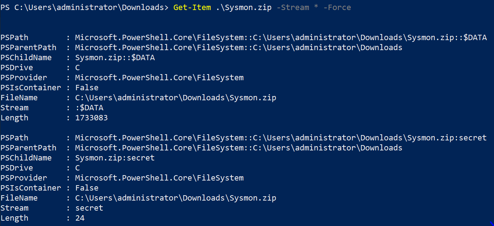

File Stream Creation Hash
=========================

Sysmon will log **EventID 15** for the creation of Alternate Data Streams (ADS). This is an old technique where many vendors already monitor for the creation of ADS on files where the alternate stream is a PE executable. Attackers have changed to use alternate streams to hide information and to store other payloads that are not PE executables (DLL, Scripts). Sysmon will also capture the contents of text streams if they are less 1KB for the purpose of capturing  Mark Of The Web (MOTW) streams.

Each record in NTFS on a drive is subdivided into a list of variable length attributes:

* \$STANDARD\_INFORMATION

* \$FILE\_NAME

* \$DATA

* \$INDEX\_ROOT

* \$BITMAP

* \$INDEX\_ALLOCATION

* \$ATTRIBUTE\_LIST

Alternate Data Streams (ADS) are implemented by having multiple \$Data
attributes

* The Default data stream is unnamed

* Alternate streams are named ones.

Since streams that are part of the NTFS structure directories may have an AD, we can use PowerShell to look at a file with the single default unamend :\$DATA stream:


File with a second named stream:



Some execution examples:

* Execution Rundll32 example

* Cscript Example

* PowerShell Example

More execution examples at
<https://gist.github.com/api0cradle/cdd2d0d0ec9abb686f0e89306e277b8f> by
Oddvar Moe

In the case of downloads performed by browsers and email clients in Windows that leveragle the urlmon.dll for downloading files they have al indetifying stream added with information about the download including the URL and Refferer. This information can be used to track the origing of downloaded files by attackers with a console presense or via a phishing attack. 

We can use PowerShell Get-Item and Get-Content cmdlets to check is a Zone.Identifier stream exist and show its content. 


The fields for the event:

* **RuleName**: Name of rule that triggered the event
* **UtcTime**: Time in UTC when event was created
* **ProcessGuid**: Process GUID of the process that created the named file stream
* **ProcessId**: Process ID used by the OS to identify the process that created the named file stream
* **Image**: File path of the process that created the named file stream
* **TargetFilename**: Name of the file
* **CreationUtcTime**: File download time
* **Hash**: Full hash of the file with the algorithms in the HashType field
* **Content**: Contents of text streams. 


The number of processes that create alternate streams should be low and easily excluded. Mail clients and browsers are the main generators of this event in normal operation to set the Zone attribute; Because of this, a maintenance process is recommended when leveraging these filters.


Since urlmon.dll sets different parts of the stream as the file is downloaded we see normally a total of 6 events as the data is added to the file. This provides important forensic information to track files that an attacker may have delived and correlated with other networks logs. 

Example: Exclude common processes that create alternate data streams.

```xml
<Sysmon schemaversion="4.22">
   <EventFiltering>
 <RuleGroup name="" groupRelation="or">
    <FileCreateStreamHash onmatch="exclude">
        <!--Chrome Web Browser-->
        <Image condition="is">C:\Program Files (x86)\Google\Chrome\Application\chrome.exe</Image>
        <!--Edge Download broker-->
        <Image condition="is">C:\Windows\system32\browser_broker.exe</Image>
        <!--Internet Explorer-->
        <Image condition="is">C:\Program Files\Internet Explorer\iexplore.exe</Image>
        <!--Outlook Client-->
        <Image condition="end with">OUTLOOK.EXE</Image>
    </FileCreateStreamHash>
</RuleGroup>
</EventFiltering>
</Sysmon>
```
