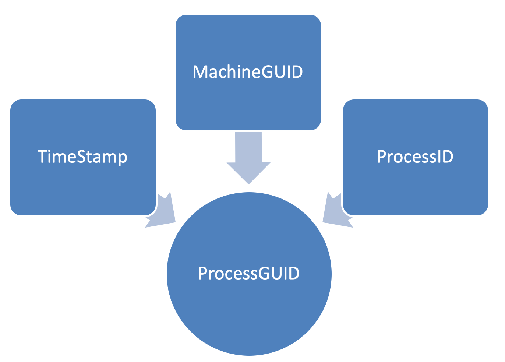
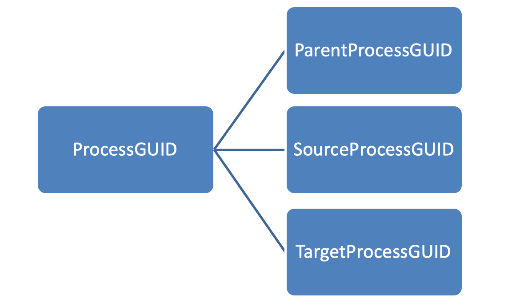
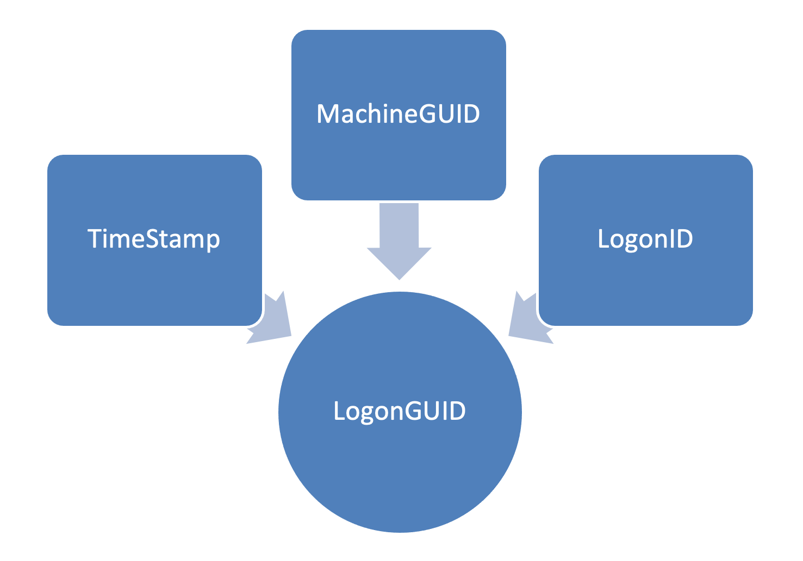
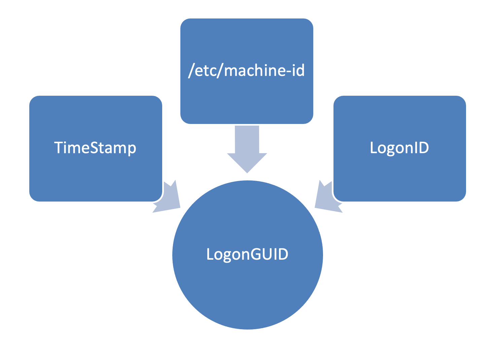

Process Events
==============

Sysmon can log process creation, process termination and process access events. For Windows the process events are captured via ObjRegisterCallbacks at the kernel level using its driver, and contain a unique, deterministically generated ProcessGuid and LogonGuid that are unique to their process instance and LSA logon session respectively.

The ProcessGuid and LoginGuid make tracking individual process and users much easier. The ProcessGuid attribute is used in all events associated with its process, and, unlike a ProcessID, will not be reused by the host system later.  The LogonGuid attribute similarly is assigned to a login session of a particular user, and will not be reused later as a LoginID would.

The ProcessGUID depending on the event and where in the process tree it
is, it will also be known by other names by its relation to the action
monitored.

ProcessGUID is generated by Sysmon when Sysmon logs the event.  ProcessGUID 
specifically is not an attribute of the internal Windows process data structs
(EPROCESS).  Sysmon keeps track of the GUID until the process exits.

In Linux the process for generating the ProcessGuid is similar to Windows with the exception that the hexadecimal value in **/etc/machine-id**, this hexadecimal value is unique per host, it is usually generated from a random source during system installation or first boot and stays constant for all subsequent boots. Optionally, for stateless systems, it is generated during runtime during early boot if necessary.

The ProcessGUIs is referenced in several events under different names.

The only Event Types that will not reference a ProcessGuid or one of its
derived names are

* WMI events

* Kernel Driver Load

All processes associated to a unique logon session can be mapped using the LogonGuid field. This field is generated using similar values as the ProcessGuid with the exception that instead of a process Id it uses in the case of Windows the Logon Session hexadecimal value and in the case of Linux the Logon Id to generate a unique identifier to match all actions taken.

For Windows

For Linux

When a user logs onto on a modern version of Windows (Windows 2016/10)
they will have 2 Logon IDs assigned if:

* User is a member of local Administrator Group.

* UAC (User Access Control) is enabled.

These sessions will be linked by a Linked Login ID in Successful Logon
Event ID 4624, making the logging of this event important.

The image of the process is also related in other processes and can be
used to track all actions related to a specific one.

